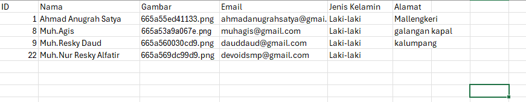

# Koneksi Database

## Kode Program
```php
<?php
//koneksi ke database
$koneksi = mysqli_connect('localhost', 'root', '', 'rental_angga');
// Memeriksa koneksi
if (!$koneksi) {
    die("Error, tidak bisa koneksi ke database: " . mysqli_connect_error());
} else {
    echo "<br> Koneksi aman <br>";
}
?>
```

## Hasil


## Analisis
- Fungsi `mysqli_connect` digunakan untuk membuat koneksi ke database MySQL.
- Parameter pertama adalah nama host, dalam hal ini 'localhost'.
- Parameter kedua adalah nama pengguna database, dalam hal ini 'root'.
- Parameter ketiga adalah kata sandi pengguna database, dalam hal ini kosong ('').
- Parameter keempat adalah nama database yang akan digunakan, dalam hal ini 'rental_angga'.
- Menggunakan fungsi `mysqli_connect_error` untuk menampilkan pesan error jika koneksi gagal. 
- Jika koneksi berhasil, pesan "Koneksi aman" akan ditampilkan.

## Kesimpulan
Kode tersebut berguna untuk memastikan bahwa koneksi ke database berhasil dilakukan sebelum menjalankan operasi-operasi database lainnya. Jika koneksi gagal, maka akan menampilkan pesan error dan menghentikan eksekusi script dengan `die()`.

# Tampilkan Data
## Kode Program
```php
<!DOCTYPE html>
<html lang="en">
<head>
    <meta charset="UTF-8">
    <meta name="viewport" content="width=device-width, initial-scale=1.0">
    <title>index tabel</title>
</head>
<body>
    <h2>Data Siswa Berprestasi</h2>
    <table border="5">
        <tr>
            <th>id_siswa</th>
            <th>nama</th>
            <th>email</th>
            <th>jenis_kelamin</th>
            <th>alamat</th>
        </tr>
        <?php
        include "koneksi.php";
        $i = 1;
        $query = mysqli_query($koneksi, "SELECT * FROM siswa");
        while ($data = mysqli_fetch_array($query)) {
            ?>
            <tr>
                <td><?php echo $i; ?></td>
                <td><?php echo $data['nama']; ?></td>
                <td><?php echo $data['email']; ?></td>
                <td><?php echo $data['jenis_kelamin']; ?></td>
                <td><?php echo $data['alamat']; ?></td>
            </tr>
            <?php
            $i++;
        }
        ?>
    </table>
</body>
</html>
```

## Hasil


## Analisis
- Baris 1-8: Membuat struktur dasar dokumen HTML dengan pengaturan charset UTF-8 dan viewport untuk memastikan kompatibilitas dengan berbagai perangkat. Judul halaman ditetapkan sebagai "index tabel".
- Baris 9-16: Membuat tabel dengan border 5 dan menambahkan header kolom untuk `id_siswa`, `nama`, `email`, `jenis_kelamin`, dan `alamat`.
- Baris 17-32: Mengimpor file koneksi database (`koneksi.php`). Menginisialisasi variabel `$i` untuk penomoran baris. Mengambil data dari tabel `siswa` di database dan menampilkan setiap baris data dalam tabel HTML. Setiap iterasi dari loop `while` menambahkan satu baris baru ke tabel HTML dengan data siswa yang diambil dari database. Penomoran baris diatur menggunakan variabel `$i` yang diincrement setiap kali data ditampilkan.
- Baris 33-35: Menutup tag tabel dan dokumen HTML.


## Kesimpulan
- Membuat struktur dasar dokumen HTML dengan pengaturan charset dan viewport.
- Membuat tabel HTML dengan header kolom untuk `id_siswa`, `nama`, `email`, `jenis_kelamin`, dan `alamat`.
- Mengimpor koneksi database.
- Mengambil data dari tabel `siswa` di database dan menampilkan setiap baris data dalam tabel HTML.
- Menampilkan setiap baris data dengan penomoran yang diatur menggunakan variabel `$i`.


# Tambahkan Data

## Kode Program
```php
<!DOCTYPE html>
<html lang="en">
<head>
    <title>Document</title>
</head>
<body>
    <h2>Tambah Data</h2>
    <?php
    include "koneksi.php";
    if (isset($_POST['simpan'])) {
        $nama = $_POST['nama'];
        $email = $_POST['email'];
        $jenis_kelamin = $_POST['jenis_kelamin'];
        $alamat = $_POST['alamat'];
        $query = mysqli_query($koneksi, "INSERT into siswa(nama,email,jenis_kelamin,alamat)
        values ('$nama','$email','$jenis_kelamin','$alamat')");
        if ($query == true) {
            echo "<script>
            alert('Tambah data Berhasil')
            window.location.href='table.php'
            </script>";
        } else {
            echo '<script>alert("Tambah data gagal")</script>';
        }
    }
    ?>
    <form method="post">
        <table>
            <tr>
                <td>Nama</td>
                <td><input type="text" name="nama"></td>
            </tr>
            <tr>
                <td>Email</td>
                <td><input type="text" name="email"></td>
            </tr>
            <tr>
                <td>Jenis Kelamin</td>
                <td>>
                    <select name="jenis_kelamin">
                        <option>Laki-laki</option>
                        <option>Perempuan</option>
                    </select>
                </td>
            </tr>
            <tr>
                <td>Alamat</td>
                <td><input type="text" name="alamat"></td>
            </tr>
            <tr>
                <td></td>
                <td>
                    <button name="simpan" type="submit">Simpan</button>
                    <button type="reset">Reset</button>
                    <a href="table.php">Kembali</a>
                </td>
            </tr>
        </table>
    </form>
</body>
</html>
```


## Hasil
### Before


### After


## Analisis
- Baris 1-8: Membuat struktur dasar dokumen HTML dengan bahasa yang ditetapkan ke bahasa Inggris dan judul halaman "Document".
- Baris 9-26: Mengimpor file koneksi database (`koneksi.php`). Memeriksa apakah tombol "simpan" telah ditekan. Jika ya, mengambil data dari form dan menyimpan data baru siswa ke dalam database. Jika berhasil, menampilkan pesan sukses dan mengarahkan pengguna ke `table.php`. Jika gagal, menampilkan pesan error.
- Baris 27-55: Membuat formulir HTML untuk menambahkan data siswa baru. Terdapat input untuk mengisi nama, email, jenis kelamin, dan alamat siswa. Terdapat juga tombol untuk menyimpan data baru, mereset form, dan kembali ke halaman `table.php`.

## Kesimpulan
1. Mengimpor koneksi database.
2. Memeriksa apakah formulir telah disubmit dan menyimpan data baru jika ya.
3. Menampilkan formulir HTML untuk mengisi data siswa baru.

Jika penambahan data berhasil dilakukan, pengguna akan diarahkan kembali ke halaman `table.php` dengan pesan sukses. Jika gagal, pengguna akan melihat pesan error. Formulir ini juga menyediakan opsi untuk mereset data yang telah diinput dan kembali ke halaman daftar siswa.


# Ubah Data
## Kode Program
```php
<!DOCTYPE html>
<html lang="en">
<head>
    <title>Document</title>
</head>
<body>
    <h2>Ubah Data</h2>
    <?php
    include "koneksi.php";
    $id = $_GET['id_siswa'];
    if (isset($_POST['simpan'])) {
        $nama = $_POST['nama'];
        $email = $_POST['email'];
        $jenis_kelamin = $_POST['jenis_kelamin'];
        $alamat = $_POST['alamat'];
        $query = mysqli_query($koneksi, "UPDATE siswa SET
                                        nama='$nama',
                                        email='$email',
                                        jenis_kelamin='$jenis_kelamin',
                                        alamat='$alamat'
                                        WHERE id_siswa=$id");
        if ($query) {
            echo "<script>
            alert('ubah data Berhasil')
            window.location.href='table.php'
            </script>";
        } else {
            echo '<script>alert("ubah data gagal")</script>';
        }
    }
    $query = mysqli_query($koneksi, "SELECT * FROM siswa where id_siswa=$id");
    $data = mysqli_fetch_array($query);
    if ($data == "") {
        die('Data tidak ada');
    }
    ?>
    <form method="post">
        <table>
            <tr>
                <td>Nama</td>
                <td><input type="text" value="<?= $data['nama'] ?>" name="nama"></td>
            </tr>
            <tr>
                <td>Email</td>
                <td><input type="text" value="<?= $data['email'] ?>" name="email"></td>
            </tr>
            <tr>
                <td>Jenis Kelamin</td>
                <td>>
                    <select name="jenis_kelamin">
                        <option <?php if ($data['jenis_kelamin'] == "laki-laki")
                            echo 'selected'; ?>>Laki-laki</option>
                        <option <?php if ($data['jenis_kelamin'] == "perempuan")
                            echo 'selected'; ?>>Perempuan</option>
                    </select>
                </td>
            </tr>
            <tr>
                <td>Alamat</td>
                <td><input type="text" value="<?= $data['alamat'] ?>" name="alamat"></td>
            </tr>
            <tr>
                <td></td>
                <td>
                    <button name="simpan" type="submit">Ubah</button>
                    <button type="reset">Reset</button>
                    <a href="table.php">Kembali</a>
                </td>
            </tr>
        </table>
    </form>
</body>
</html>
```


## Hasil

### Before


### After


## Analisis
- Baris 1-8: Membuat struktur dasar dokumen HTML dengan bahasa yang ditetapkan ke bahasa Inggris dan judul halaman "Document".
- Baris 9-11: Mengimpor file koneksi database (`koneksi.php`) dan mengambil parameter `id_siswa` dari URL.
- Baris 12-26: Memeriksa apakah tombol "simpan" telah ditekan. Jika ya, mengambil data dari form dan mengupdate data siswa di database. Jika berhasil, menampilkan pesan sukses dan mengarahkan pengguna ke `table.php`. Jika gagal, menampilkan pesan error.
- Baris 27-32: Mengambil data siswa dari database berdasarkan `id_siswa`. Jika data tidak ditemukan, menghentikan eksekusi dengan pesan "Data tidak ada".
- Baris 33-64: Membuat formulir HTML untuk mengubah data siswa dengan mengisi nilai awal berdasarkan data yang diambil dari database. Terdapat pilihan untuk mengubah nama, email, jenis kelamin, dan alamat siswa. Terdapat juga tombol untuk menyimpan perubahan, mereset form, dan kembali ke halaman `table.php`.

## Kasimpulan
1. Mengimpor koneksi database.
2. Mengambil `id_siswa` dari URL.
3. Memeriksa apakah formulir telah disubmit dan melakukan update data jika ya.
4. Mengambil data siswa dari database untuk mengisi nilai awal form.
5. Menampilkan formulir HTML dengan data yang bisa diubah.

Jika perubahan data berhasil dilakukan, pengguna akan diarahkan kembali ke halaman `table.php` dengan pesan sukses. Jika gagal, pengguna akan melihat pesan error. Formulir ini juga menyediakan opsi untuk mereset data yang telah diinput dan kembali ke halaman daftar siswa.


# Hapus Data
## Kode Program
```php
<?php
include('koneksi.php');
if(isset($_GET['id'])){
    $id = $_GET['id'];
    $query = mysqli_query($koneksi, "DELETE FROM siswa WHERE id_siswa = $id");
   if($query) {
            echo "<script>
            alert('Hapus data Berhasil')
            window.location.href='table.php'
            </script>";
        }else {
            echo '<script>alert("Hapus data gagal")</script>';
        }
}
?>
```


## Hasil


### Before


### After


## Analisis
- Mengimpor file koneksi database (`koneksi.php`).
- Memeriksa apakah parameter ID (`$_GET['id']`) telah diberikan melalui URL.
- Jika ID telah diberikan, maka ID tersebut disimpan dalam variabel `$id`.
- Selanjutnya, melakukan query DELETE untuk menghapus data siswa dari tabel `siswa` berdasarkan ID siswa yang diberikan.
- Jika query DELETE berhasil dilakukan, maka akan menampilkan pesan sukses menggunakan JavaScript `alert` dan mengarahkan pengguna kembali ke halaman `table.php`.
- Jika query DELETE gagal, akan menampilkan pesan error menggunakan JavaScript `alert`.


## Kesimpulan
- **Koneksi Database**: Kode tersebut memastikan terjadi koneksi yang sukses ke database sebelum melakukan operasi penghapusan data.
    
- **Penghapusan Data**: Jika parameter ID (`$_GET['id']`) tersedia dalam URL, maka data siswa dengan ID tersebut akan dihapus dari tabel `siswa` menggunakan perintah SQL `DELETE`.
    
- **Feedback Pengguna**: Setelah operasi penghapusan selesai, pengguna akan diberikan feedback berupa pesan sukses jika penghapusan berhasil dilakukan, atau pesan gagal jika terjadi masalah dalam penghapusan data.
    
- **Redirect**: Setelah pesan sukses ditampilkan, pengguna akan diarahkan kembali ke halaman `table.php` agar dapat melihat perubahan yang telah terjadi.


# Session/Login

## Kode Program
```php
<?php
session_start();
if (isset($_POST['submit'])) {
    $username = $_POST['username'];
    $password = $_POST['password'];
    $koneksi = mysqli_connect('localhost', 'root', '', 'basis_data') or die('error koneksi');
    $result = mysqli_query($koneksi, "SELECT * FROM user WHERE username = '$username' AND password = '$password'");
    $data = mysqli_fetch_assoc($result);
    if (isset($data)) {
        $_SESSION['username'] = $data['username'];
        $_SESSION['nama'] = $data['nama'];
        $_SESSION['status'] = 'login';
        header('Location: user.php');
    } else {
        echo "Username dan Password Salah";
    }
}
?>
<!DOCTYPE html>
<html>
<head>
    <title>Login Session</title>
</head>
<body>
    <form method="post">
        <label>Username</label>
        <input type="text" name="username">
        <br>
        <label>Password</label>
        <input type="password" name="password">
        <br>
        <button type="submit" name="submit">Login</button>
    </form>
</body>
</html>
```

## Hasil

### Before


### After


## Analisis
- Fungsi `session_start()` digunakan untuk memulai session di PHP. Ini harus dipanggil di setiap halaman yang menggunakan session.
- Saat form login disubmit (`isset($_POST['submit'])`), nilai dari input username dan password diambil.
- Dilakukan koneksi ke database dan query untuk mencari data pengguna dengan username dan password yang cocok.
- Jika data ditemukan, session untuk username, nama, dan status login diset, dan pengguna diarahkan ke halaman `user.php`.
- Jika data tidak ditemukan, akan ditampilkan pesan "Username dan Password Salah".
- Form ini berisi input untuk username dan password, serta tombol submit untuk mengirim data login.


## Kesimpulan
1. **Session Management**: Kode menggunakan `session_start()` untuk memulai session, dan `$_SESSION` digunakan untuk menyimpan informasi tentang pengguna yang sedang login seperti username, nama, dan status.
    
2. **Form Login**: Form login menggunakan metode POST untuk mengirimkan data username dan password. Jika form disubmit, kode akan mencocokkan informasi login dengan data yang ada di database.
    
3. **Database Connection**: Kode menggunakan fungsi `mysqli_connect()` untuk melakukan koneksi ke database MySQL. Ini dilakukan sebelum proses pengecekan login dilakukan.
    
4. **Redirect**: Jika informasi login benar, pengguna diarahkan ke halaman `user.php`. Jika tidak, pesan error ditampilkan.
    
5. **Keamanan**: Kode ini hanya menyajikan contoh sederhana dan tidak menerapkan praktik keamanan yang lengkap, seperti penggunaan prepared statement untuk mencegah SQL injection atau hashing password untuk keamanan password.
    
6. **Kesimpulan**: Kode ini menunjukkan cara dasar mengelola proses login menggunakan session di PHP. Ini adalah fondasi yang baik untuk dikembangkan lebih lanjut dengan penanganan kesalahan yang lebih baik, keamanan yang lebih baik, dan fitur tambahan seperti logout.


# Upload dan Download
## Upload
### Kode Program
```php
function upload(): string
{
    $nameImage = $_FILES['imageNew']['name'];
    $directoryFile = $_FILES['imageNew']['tmp_name'];
    $errorImage = intval($_FILES['imageNew']['error']);
    $sizeFile = $_FILES['imageNew']['size'];
    // cek apakah gambar ada
    if ($errorImage === 4) {
        echo "<script>alert('Anda Belum Upload Gambar')</script>";
        return false;
    }
    // mengambil ekstensi file
    $validType = ['svg', 'jpg', 'png', 'jpeg', 'webp'];
    $extensionFile = explode(".", $nameImage);
    $extensionValid = strtolower(end($extensionFile));
    // cek apakah yang diupload gambar atau bukan
    if (!in_array($extensionValid, $validType)) {
        echo "<script>alert('yang anda Upload bukan gambar')</script>";
        return false;
    }
    // cek size file
    if ($sizeFile > 3_000_000) {
        echo "<script>alert('Ukuran File Terlalu Besar!!(Maks 3MB)')</script>";
        return false;
    }
    // upload file
    $nameImage = uniqid() . "." . $extensionValid;
    move_uploaded_file($directoryFile, "../assets/img/{$nameImage}");
    // mengembalikan namafile yg sudah divalidasi
    return $nameImage;
}
```

### Hasil


### Analisis
- **Variabel Input**: Fungsi ini mengambil input dari form dengan menggunakan variabel `$_FILES['imageNew']` untuk mendapatkan informasi tentang file gambar yang diunggah seperti nama file (`$nameImage`), lokasi sementara file (`$directoryFile`), error jika terjadi (`$errorImage`), dan ukuran file (`$sizeFile`).
    
- **Validasi**:
    
    - Fungsi ini melakukan beberapa validasi terhadap file gambar yang diunggah.
    - Pertama, dilakukan pengecekan apakah gambar sudah diunggah atau belum. Jika belum, akan muncul pesan peringatan dan fungsi akan mengembalikan `false`.
    - Selanjutnya, dilakukan pengecekan ekstensi file untuk memastikan bahwa yang diunggah adalah file gambar dengan ekstensi yang diizinkan (svg, jpg, png, jpeg, webp). Jika bukan gambar, akan muncul pesan peringatan dan fungsi akan mengembalikan `false`.
    - Kemudian, dilakukan pengecekan ukuran file. Jika ukurannya melebihi 3MB, akan muncul pesan peringatan dan fungsi akan mengembalikan `false`.
- **Proses Upload**: Jika semua validasi berhasil, maka file gambar akan diupload ke direktori yang ditentukan (`../assets/img/`) dengan nama file yang diacak (`$nameImage`).
    
- **Pengembalian Nama File**: Fungsi ini mengembalikan nama file gambar yang sudah divalidasi dan diupload agar dapat digunakan untuk menyimpan informasi file gambar tersebut di database atau di tempat lain yang diperlukan.
    
- **Pesan Peringatan**: Pesan peringatan ditampilkan menggunakan JavaScript `alert()` untuk memberi tahu pengguna tentang masalah yang terjadi saat upload file gambar.

### Kesimpulan
- **Validasi Input**: Fungsi ini melakukan validasi terhadap file gambar yang diunggah, termasuk pengecekan apakah file sudah diunggah, jenis file yang diunggah, dan ukuran file yang diunggah.
    
- **Penanganan Kesalahan**: Jika terjadi kesalahan dalam proses upload, seperti file belum diunggah, jenis file yang tidak valid, atau ukuran file yang terlalu besar, fungsi akan memberikan pesan peringatan dan mengembalikan `false`.
    
- **Proses Upload**: Jika tidak terjadi kesalahan, fungsi akan mengacak nama file gambar dan mengupload file gambar ke direktori yang ditentukan.
    
- **Pengembalian Nama File**: Fungsi akan mengembalikan nama file gambar yang sudah divalidasi dan diupload, sehingga dapat digunakan untuk keperluan selanjutnya, seperti menyimpan informasi file gambar tersebut di database.
    
- **Pesan Peringatan**: Pesan peringatan ditampilkan menggunakan JavaScript `alert()` untuk memberitahu pengguna tentang masalah yang terjadi saat upload file gambar.


## Download
### Kode Program
```php
<?php
include "koneksi.php";
$query = mysqli_query($koneksi, 'SELECT * FROM siswa');
$data = [];
$data[] = ["ID", "Nama", "Gambar", "Email", "Jenis Kelamin", "Alamat"];
while ($row = mysqli_fetch_assoc($query)) {
    $data[] = [
        $row['id_siswa'],
        $row['nama'],
        $row['gambar']
        $row['email'],
        $row['jenis_kelamin'],
        $row['alamat']
    ];
}
$namafile = "excel_data.xls";
header("Content-Type: application/vnd.ms-xls");
header("Content-Disposition: attachment;filename=\"$namafile\"");
header("Cache-Control: max-age=0");
$output = fopen("php://output", "w");
foreach ($data as $row) {
    fputcsv($output, $row, "\t");
}
fclose($output);
exit;
```

### Hasil



### Analisis
- **Koneksi Database**: Kode menggunakan `include "koneksi.php";` untuk mengimpor file koneksi database yang menghubungkan ke database MySQL.
    
- **Query dan Pengambilan Data**: Dilakukan query `SELECT * FROM siswa` untuk mengambil semua data siswa dari tabel `siswa` dalam database. Data kemudian dimasukkan ke dalam array `$data` dalam format yang sesuai untuk diekspor ke file Excel.
    
- **Penyiapan File Excel**: Kode menggunakan header HTTP untuk mengatur tipe konten menjadi `application/vnd.ms-xls` agar browser menganggap file ini sebagai file Excel. Header `Content-Disposition` digunakan untuk memberi nama file Excel yang akan diunduh.
    
- **Penulisan Data ke File Excel**: Menggunakan `fputcsv()` untuk menulis data ke file Excel dengan delimiter tab (`"\t"`).
    
- **Penutup dan Keluar**: Setelah data ditulis ke file Excel, `fclose($output);` digunakan untuk menutup file dan `exit;` digunakan untuk mengakhiri skrip PHP.


### Kesimpulan
Kode tersebut digunakan untuk mengambil data siswa dari database MySQL dan menyimpannya ke dalam file Excel yang kemudian diunduh oleh pengguna. Ini memanfaatkan kemampuan PHP untuk menghasilkan file Excel dengan menggunakan delimiter tab untuk memisahkan data. Kode ini memungkinkan pengguna untuk dengan mudah mengunduh data dalam format yang mudah dibaca dan dapat diedit di Excel.


