# Apa itu web dinamis dan PHP
Web dinamis adalah jenis situs web yang menggunakan konten yang dapat berubah secara dinamis berdasarkan interaksi pengguna, data yang disimpan dalam database, atau logika bisnis tertentu. Berbeda dengan situs web statis yang memiliki konten tetap, situs web dinamis memungkinkan pengguna untuk berinteraksi dengan konten yang berubah sesuai dengan kebutuhan atau preferensi mereka.

PHP adalah bahasa pemrograman server-side yang sering digunakan untuk mengembangkan aplikasi web dinamis. Singkatan PHP adalah "Hypertext Preprocessor". PHP bekerja di sisi server, yang berarti kode PHP dijalankan di server web sebelum hasilnya dikirim ke browser pengguna. PHP dapat digunakan untuk melakukan berbagai tugas di situs web, termasuk mengambil dan menyimpan data dari database, menghasilkan halaman web secara dinamis, menangani formulir, dan banyak lagi. Ini adalah salah satu bahasa pemrograman paling populer yang digunakan untuk pengembangan web, terutama untuk situs web dinamis.

#  Echo & commentar
Echo merujuk pada tindakan mereproduksi atau membagikan kembali konten yang sudah ada kepada pengikut atau audiens Anda. Misalnya, jika seseorang memposting tweet atau kiriman di platform sosial lainnya, dan Anda memutuskan untuk membagikan kembali (retweet, share, dll.) konten tersebut kepada pengikut Anda, itu disebut sebagai "echo". Praktik ini memungkinkan untuk menyebarkan informasi lebih luas atau memberi penghargaan pada konten yang dianggap relevan atau menarik.

Komentar, di sisi lain, adalah respons atau tanggapan yang diberikan oleh pengguna terhadap konten yang diposting oleh pengguna lain. Ini bisa berupa pertanyaan, pendapat, dukungan, kritik, atau reaksi lainnya terhadap apa yang telah dibagikan. Komentar memungkinkan untuk berinteraksi dengan konten dan pengguna lainnya, membuka diskusi, atau memberikan umpan balik.
# Program pertama
## Kode Program
```php
<?php
// Komentar satu baris
/* Komentar
banyak
baris
*/
//Variebel
$meja = 30;
$tk_kelas = "XI";
$ketua_kelas = "July";
$wali_kelas = "Saleh";
$ketua_gank = "Rahmat"; //Pengubahan nilai
//Konstanta
const KEPSEK = "Herwelis";
define('Kelas', 'RPL 1');
/*Kutip satu hanya membaca STRING, variabel  dan string
 dipisahkan dengan tanda titik*/
echo 'Jumlah meja di kelas: ' .  $meja  . ' buah';
echo "<br>";
//Kutip dua bisa membaca nilai dari sebuah variabel
    echo "sholat dulu, nabilang pak $wali_kelas dan $ketua_kelas";
echo "<br>";
//Kutip satu dibaca string disini
echo "kalo tidak, diracca' sama ketua gank $ketua_gank";
echo "<br>";
//Pemnggilan konstanta
echo 'Kepseknya ' .  KEPSEK;
echo "<br>";
echo 'Kelasnya ' . $tk_kelas . ' '. Kelas;
?>
```


## Hasil
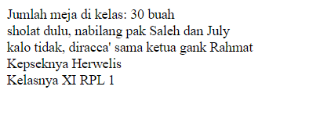


# Echo
## Kutip satu

### Kode Program
```php
<?php
$meja = 30;
echo 'Jumlah meja di kelas: ' .  $meja  . ' buah';
?>
```
### Hasil
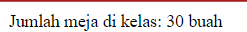

### Penjelasan


## kutip dua
### Kode Program
```php
<?php
$ketua_kelas = "July";
$wali_kelas = "Saleh";
echo "sholat dulu, nabilang pak $wali_kelas dan $ketua_kelas";
?>
```

### Hasil
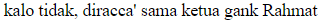


# komentar
## single line
### Kode Program
```php
//ini digunakan untuk ketika mau membuat satu baris komentar
```

### Penjelasan
Digunakan untuk menambahkan komentar pada satu baris saja. Komentar ini dimulai dengan tanda double slash (`//`) dan berlaku hingga akhir baris.


## multiple line
### Kode Program
```php
/*ini digunakan
untuk ketika 
mau membuat 
lebih dari
satu baris komentar*/
```

### Penjelasan
Digunakan untuk menambahkan komentar yang lebih dari satu baris. Komentar ini dimulai dengan `/*` dan diakhiri dengan `*/`, dan dapat mencakup beberapa baris kode.


# Variabel, Konstanta, operator
### Kode Program

```php
<?php
$nama = "Dimas"; $umur = 5;
echo "perkenalkan nama saya $nama dan umur saya $umur" 
?>
```

### Hasil
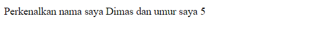

### Penjelasan
Variabel adalah tempat untuk menyimpan data yang dapat berubah nilainya selama eksekusi program. Anda bisa mendeklarasikan variabel dengan menggunakan tanda dollar ($) diikuti dengan nama variabelnya. 


### Kode Program
```php
<?php
const JARAK = "8 KM";
echo "Edo: Emang seberapa jauh sih rumahmu ke sekolah? <br>";
echo "Rina: Hmm, mungkin sekitar " . JARAK . ".";
?>
```

### Hasil
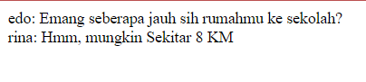

### Penjelasan
Konstanta adalah seperti variabel, tetapi nilainya tidak dapat diubah selama eksekusi program. Anda mendeklarasikan konstanta menggunakan fungsi define()


### Kode Program
```php
<?php
// operator aritmatika
$a = 5;
$b = 3;
$jumlah = $a + $b;
echo "a + b = " . $jumlah . "<br>";
// operator perbandingan
$is_lebih_besar = ($a > $b);
echo "a > b = " . ($is_lebih_besar ? 'true' : 'false') . "<br>";
// operator logika
$is_true = ($a == 5 && $b == 3);
echo "a && b = " . ($is_true ? 'true' : 'false') . "<br>";
?>
```

### Hasil
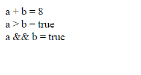

### Penjelasan
Operator adalah simbol yang digunakan untuk melakukan operasi pada variabel dan nilai. Ada berbagai macam operator dalam PHP, seperti operator aritmatika (+, -, *, /), operator perbandingan (==, !=, <, >), dan operator logika (&&, ||, !).


# Conditional Statement
## IF
### Penjelasan
Kondisional statement `IF` digunakan untuk melakukan pemeriksaan kondisi tertentu. Jika kondisi tersebut benar (true), maka blok kode di dalam IF akan dieksekusi. Jika kondisi salah (false), maka blok kode tersebut tidak dieksekusi.

### Struktrur Program
```php
if (kondisi) {
    // blok kode yang akan dieksekusi jika kondisi benar
}
```

### Kode Program
```php
<?php
$nilai = 80;
if ($nilai >= 70) {
    echo "Nilai Anda lulus.";
}
?>
```

### Hasil
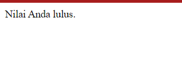
### Analisis
- Baris 1: Sebuah variabel `$nilai` diinisialisasi dengan nilai 80.
- Baris 2: Kondisi dievaluasi, yaitu apakah nilai `$nilai` lebih besar atau sama dengan 70.
- Baris 3: Karena kondisi benar (true), maka blok kode di dalam IF dieksekusi.
- Baris 4: Mencetak teks "Nilai Anda lulus." karena nilai `$nilai` memenuhi kondisi.

### Kesimpulan Program
Program akan mencetak "Nilai Anda lulus." karena nilai `$nilai` adalah 80, yang lebih besar dari atau sama dengan 70.

## Else IF

### Penjelasan

Kondisional statement `Else IF` digunakan untuk menambahkan kondisi tambahan setelah kondisi IF. Jika kondisi IF tidak terpenuhi (false), maka kondisi Else IF akan dicek. Jika kondisi Else IF benar (true), maka blok kode di dalam Else IF akan dieksekusi.

### Struktur program

```php
if (kondisi1) {     
// blok kode yang akan dieksekusi jika kondisi1 benar 
} else if (kondisi2) {     
// blok kode yang akan dieksekusi jika kondisi2 benar 
}
```

### Kode Program
```php
<?php
$nilai = 55; 
if ($nilai >= 70) {  
echo "Nilai Anda lulus."; 
} else if ($nilai >= 60) {
echo "Anda dapat remedial."; 
} else { 
echo "Anda tidak lulus.";
}
?>
```

### Hasil
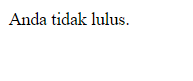

### Analisis

- Baris 1: Sebuah variabel `$nilai` diinisialisasi dengan nilai 55.
- Baris 2: Kondisi pertama dievaluasi, yaitu apakah nilai `$nilai` lebih besar atau sama dengan 70. Kondisi ini tidak terpenuhi (false).
- Baris 3: Kondisi kedua dievaluasi, yaitu apakah nilai `$nilai` lebih besar atau sama dengan 60. Kondisi ini juga tidak terpenuhi (false).
- Baris 4: Karena kedua kondisi sebelumnya tidak terpenuhi, maka blok kode di dalam ELSE dieksekusi.
- Baris 5: Mencetak teks "Anda tidak lulus." karena nilai `$nilai` kurang dari 60.

### Kesimpulan Program

Program akan mencetak "Anda tidak lulus." karena nilai `$nilai` adalah 55, yang kurang dari 60.


## Else

### Penjelasan

Kondisional statement `Else` digunakan untuk mengeksekusi blok kode tertentu jika kondisi IF sebelumnya tidak terpenuhi (false).

### Struktur program
```php
if (kondisi){     
// blok kode yang akan dieksekusi jika kondisi benar 
} else {     
// blok kode yang akan dieksekusi jika kondisi salah 
}
```

### Kode Program
```php
<?php
$nilai = 55; 
if ($nilai >= 60) 
{
echo "Nilai Anda lulus."; 
} else { 
echo "Anda tidak lulus.";
}
?>
```

### Hasil


### Analisis
- Baris 1: Sebuah variabel `$nilai` diinisialisasi dengan nilai 55.
- Baris 2: Kondisi dievaluasi, yaitu apakah nilai `$nilai` lebih besar atau sama dengan 60. Kondisi ini tidak terpenuhi (false).
- Baris 3: Karena kondisi sebelumnya tidak terpenuhi, maka blok kode di dalam ELSE dieksekusi.
- Baris 4: Mencetak teks "Anda tidak lulus." karena nilai `$nilai` kurang dari 60.

### Kesimpulan Program

Program akan mencetak "Anda tidak lulus." karena nilai `$nilai` adalah 55, yang kurang dari 60.

## Switch Case

### Penjelasan

Kondisional statement `Switch Case` digunakan untuk membandingkan nilai ekspresi dengan beberapa nilai yang mungkin. Jika nilai ekspresi cocok dengan salah satu nilai `case`, maka blok kode di dalam `case` tersebut akan dieksekusi.

### Struktur program
```php
switch (ekspresi) {     
case nilai1:         
// blok kode yang akan dieksekusi jika ekspresi sama dengan nilai1         
break;     
case nilai2:         
// blok kode yang akan dieksekusi jika ekspresi sama dengan nilai2         
break;     
default:         
// blok kode yang akan dieksekusi jika tidak ada case yang cocok 
}
```


### Kode Program
```php
?<php
$nilai = 'B'; switch ($nilai) {    
case 'A':         
echo "Anda sangat baik.";
break;    
case 'B':  
echo "Anda baik.";  
break;     
case 'C':        
echo "Anda cukup.";
break;     
default: 
echo "Anda tidak lulus."; 
}
?>
```

### Hasil
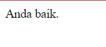

### Analisis

- Baris 1: Sebuah variabel `$nilai` diinisialisasi dengan nilai 'B'.
- Baris 2: Nilai `$nilai` dibandingkan dengan nilai-nilai case di dalam switch.
- Baris 3-5: Karena nilai `$nilai` sama dengan 'B', maka blok kode di dalam case 'B' dieksekusi.
- Baris 6: Mencetak teks "Anda baik." karena nilai `$nilai` sama dengan 'B'.

### Kesimpulan Program

Program akan mencetak "Anda baik." karena nilai `$nilai` adalah 'B', yang cocok dengan case 'B'.

## Array

### Array 1 Dimensi

#### Penjelasan

Array 1 dimensi adalah struktur data yang dapat menyimpan beberapa nilai dalam satu variabel. Setiap nilai dalam array memiliki indeks numerik yang dimulai dari 0.

#### Struktur program
```php
$nama_array = array(nilai1, nilai2, nilai3, ...);
```

##### Kode Program
```php
<?php
$buah = array(
"Apel", "Jeruk", "Mangga", "Anggur"
); 
echo "Saya suka makan " . $buah[0];
?>
```

### Hasil


#### Analisis

- Baris 1: Membuat array `$buah` dengan nilai "Apel", "Jeruk", "Mangga", dan "Anggur".
- Baris 2: Mencetak teks "Saya suka makan Apel" karena nilai dengan indeks 0 dalam array adalah "Apel".

#### Kesimpulan Program

Program akan mencetak "Saya suka makan Apel" karena nilai dengan indeks 0 dalam array `$buah` adalah "Apel".

### Array Asosiatif

#### Penjelasan

Array asosiatif adalah struktur data yang menggunakan nama kunci (key) untuk setiap nilai dalam array. Ini memungkinkan kita untuk mengakses nilai berdasarkan kunci yang ditetapkan.

#### Struktur program

```php
$nama_array = array("kunci1" => nilai1, "kunci2" => nilai2, "kunci3" => nilai3, ...);
```
#### Kode Program

```php
<?php
$siswa = array("nama" => "John", "umur" => 20, "kelas" => "XII"); 
echo $siswa["nama"] . " berusia " . $siswa["umur"] . " tahun.";
?>
```


### Hasil
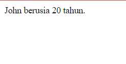


#### Analisis

- Baris 1: Membuat array `$siswa` dengan kunci "nama", "umur", dan "kelas".
- Baris 2: Menggunakan kunci "nama" dan "umur" untuk mengakses nilai dalam array `$siswa`.
- Baris 2: Mencetak teks "John berusia 20 tahun."

#### Kesimpulan Program

Program akan mencetak "John berusia 20 tahun." karena nilai dengan kunci "nama" adalah "John" dan nilai dengan kunci "umur" adalah 20 dalam array `$siswa`.

## Multidimensi

### Penjelasan

Array multidimensi adalah array yang memiliki satu atau lebih array di dalamnya. Hal ini memungkinkan kita untuk membuat struktur data yang kompleks, seperti matriks.

### Struktur program
```php
$nama_array = array(     
array(nilai1, nilai2, nilai3, ...),     
array(nilai1, nilai2, nilai3, ...),     
... );
```
### Kode Program
```php
<?php
$matriks = array(  
array(1, 2, 3),  
array(4, 5, 6),
array(7, 8, 9) ); 
echo $matriks[1][2]; // Mengakses nilai 6
?>
```

### Hasil


### Analisis

- Baris 1-3: Membuat array `$matriks` yang berisi array-array dengan nilai tertentu.
- Baris 4: Menggunakan indeks 1 dan 2 untuk mengakses nilai 6 dalam array `$matriks`.
- Baris 4: Mencetak nilai 6.

### Kesimpulan Program

Program akan mencetak nilai 6 karena nilai tersebut berada di indeks 1 dan 2 dalam array `$matriks`.

## var_dump

### Penjelasan

Fungsi `var_dump` digunakan untuk menampilkan informasi tentang tipe dan nilai dari sebuah variabel atau ekspresi. Ini berguna untuk debugging dan pemahaman tentang struktur data.

### Struktur program
```php
var_dump(variabel);
```
### Kode Program
```php
<?php
$angka = 10; 
var_dump($angka);
?>
```

### Hasil
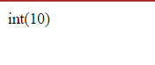


### Analisis

- Baris 1: Mendeklarasikan variabel `$angka` dengan nilai 10.
- Baris 2: Menggunakan `var_dump` untuk menampilkan informasi tentang variabel `$angka`.

### Kesimpulan Program

Program akan menampilkan `int(10)`, yang berarti `$angka` adalah integer dengan nilai 10.

## Looping

### For

#### Penjelasan

For loop digunakan untuk mengulang blok kode sejumlah tertentu kali. Ini sering digunakan ketika kita sudah mengetahui berapa kali iterasi yang diperlukan.

#### Struktur program
```php
for (inisialisasi; kondisi; perubahan){     
// blok kode yang akan diulang 
}
```
#### Kode Program
```php
<?php
for ($i = 1; $i <= 5; $i++) { 
echo "Nomor: $i <br>"; 
}
?>
```

### Hasil
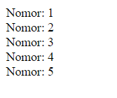


#### Analisis

- Baris 1: Inisialisasi variabel `$i` dengan nilai 1.
- Baris 2: Kondisi, loop akan terus berjalan selama `$i` kurang dari atau sama dengan 5.
- Baris 3: Setiap iterasi, nilai `$i` akan bertambah satu.
- Baris 4: Mencetak nomor dari 1 sampai 5.
#### Kesimpulan Program

Program akan mencetak nomor dari 1 sampai 5.

### While

#### Penjelasan

While loop digunakan untuk mengulang blok kode selama kondisi tertentu bernilai true. Ini berguna ketika jumlah iterasi tidak diketahui sebelumnya.

#### Struktur program
```php
while (kondisi) {  
// blok kode yang akan diulang 
}
```
##### Kode Program
```php
<?php
$i = 1; 
while ($i <= 5) {
echo "Nomor: $i <br>";  
$i++; 
}
?>
```

### Hasil


#### Analisis

- Baris 1: Mendeklarasikan variabel `$i` dengan nilai 1.
- Baris 2: Loop akan terus berjalan selama nilai `$i` kurang dari atau sama dengan 5.
- Baris 3: Mencetak nomor dari 1 sampai 5.
- Baris 4: Setiap iterasi, nilai `$i` akan bertambah satu.
#### Kesimpulan Program

Program akan mencetak nomor dari 1 sampai 5.

### Do-While

#### Penjelasan

Do-While loop mirip dengan While loop, namun perbedaannya adalah Do-While loop akan menjalankan blok kode setidaknya sekali, bahkan jika kondisi tidak terpenuhi.

#### Struktur program
```php
do {     
// blok kode yang akan diulang 
} 
while (kondisi);
```
#### Kode Program
```php
<?php
$i = 1; do {     
echo "Nomor: $i <br>"; 
$i++; } 
while ($i <= 5);
?>
```
### Hasil

#### Analisis

- Baris 1: Mendeklarasikan variabel `$i` dengan nilai 1.
- Baris 2-4: Mencetak nomor dari 1 sampai 5. Walaupun kondisi tidak terpenuhi, blok kode akan dijalankan sekali karena sifat Do-While loop.
#### Kesimpulan Program

Program akan mencetak nomor dari 1 sampai 5.

### Foreach

#### Penjelasan

Foreach loop digunakan untuk mengulang elemen-elemen dalam sebuah array. Loop ini berguna untuk mengakses setiap nilai dalam array tanpa harus mengkhawatirkan indeksnya.

#### Struktur program
```php
foreach ($array as $nilai) {  
// blok kode yang akan diulang 
}
```
#### Kode Program
```php
<?php
$buah = array("Apel", "Jeruk", "Mangga", "Anggur"); 
foreach ($buah as $nama) {
echo "Saya suka makan $nama <br>"; 
}
?>
```

### Hasil
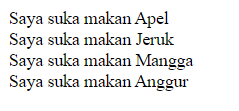


#### Analisis

- Baris 1: Mendefinisikan array `$buah`.
- Baris 2: Foreach loop akan mengulang setiap nilai dalam array `$buah` dan menyimpannya dalam variabel `$nama`.
- Baris 3: Mencetak teks "Saya suka makan ..." untuk setiap nilai dalam array `$buah`.
#### Kesimpulan Program

Program akan mencetak teks "Saya suka makan ..." untuk setiap nilai dalam array `$buah`.

### Function

#### Penjelasan

Function digunakan untuk mengelompokkan blok kode yang akan dijalankan secara bersamaan. Ini memungkinkan kita untuk menggunakan kode yang sama berulang kali tanpa harus menulis ulang.

#### Struktur program
```php
function nama_function($parameter1, $parameter2, ...) 
{     // blok kode yang akan dijalankan 
}
```


#### Kode Program
```php
<?php
function tambah($a, $b) {
return $a + $b; 
} 
$hasil = tambah(5, 3); 
echo "Hasil penjumlahan: $hasil";
?>
```

### Hasil
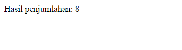


#### Analisis

- Baris 1-3: Mendefinisikan function `tambah` yang menerima dua parameter `$a` dan `$b` dan mengembalikan hasil penjumlahan.
- Baris 5: Memanggil function `tambah` dengan nilai 5 dan 3 sebagai parameter.
- Baris 6: Mencetak hasil penjumlahan.

#### Kesimpulan Program

Program akan mencetak hasil penjumlahan dari 5 dan 3, yaitu 8.

## PHP Form

### GET Method

#### Penjelasan

Metode GET digunakan untuk mengirimkan data form ke server dalam URL. Data form akan terlihat pada URL dan cocok untuk digunakan dalam kasus-kasus di mana data yang dikirimkan tidak sensitif.

#### Struktur program
```html
<!DOCTYPE html>
<html lang="en">
<head>
    <title>Document</title>
</head>
<body>
    <!-- Pada atribut action, kalian tuliskan nama file php yang bertugas untuk mengelola atau menangkap data dari form tersebut. -->
    <form action="proses_get.php" method="GET">
        <input type="text" name="nama" placeholder="Masukkan nama">
        <input type="number" name="umur" placeholder="Masukkan umur"> <br>
        <button type="submit">Kirim</button>
    </form>
</body>
</html>
```
#### Kode Program 
```php
<?php
// Key dari array-nya, sesuai dengan nama dari atribut name di setiap input-nya
$nama = $_GET["nama"];
$umur = $_GET["umur"];
?>
<!DOCTYPE html>
<html lang="en">
<head>
    <meta charset="UTF-8">
    <meta name="viewport" content="width=device-width, initial-scale=1.0">
    <title>Ariq Hikari Hidayat - XI RPL 2 - GET</title>
</head>
<body>
    <p>Nama anda
        <?= $nama ?>
    </p>
    <p>Umur anda <?= $umur ?> tahun</p>
</body>
</html>
```

### Hasil
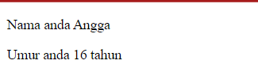


#### Analisis
#### PHP Script (Baris 1-5)

1. `<?php`
    - Membuka blok kode PHP.
2. `// Key dari array-nya, sesuai dengan nama dari atribut name di setiap input-nya`
    - Komentar yang menjelaskan bahwa kunci array sesuai dengan atribut name dari input form.
3. `$nama = $_GET["nama"];`
    - Mengambil nilai dari parameter GET "nama" dan menyimpannya dalam variabel `$nama`.
4. `$umur = $_GET["umur"];`
    - Mengambil nilai dari parameter GET "umur" dan menyimpannya dalam variabel `$umur`.
5. `?>`
    - Menutup blok kode PHP.
6. `<!DOCTYPE html>`
    - Deklarasi tipe dokumen HTML.
7. `<html lang="en">`
    - Tag pembuka HTML dengan atribut bahasa "en" (English).
8. `<head>`
    - Tag pembuka untuk bagian kepala dokumen HTML.
9. `<meta charset="UTF-8">`
    - Menentukan set karakter yang digunakan adalah UTF-8.
10. `<meta name="viewport" content="width=device-width, initial-scale=1.0">`
    - Mengatur tampilan halaman untuk mendukung berbagai ukuran layar.
11. `<title>Ariq Hikari Hidayat - XI RPL 2 - GET</title>`
    - Judul halaman yang akan ditampilkan pada tab browser.
12. `</head>`
    - Tag penutup untuk bagian kepala dokumen HTML.
13. `<body>`
    - Tag pembuka untuk bagian tubuh dokumen HTML.
14. `<p>Nama anda <?= $nama ?></p>`
    - Menampilkan paragraf yang berisi nama yang diterima dari form GET menggunakan sintaks shorthand PHP `<?= ?>`.
15. `<p>Umur anda <?= $umur ?> tahun</p>`
    - Menampilkan paragraf yang berisi umur yang diterima dari form GET menggunakan sintaks shorthand PHP `<?= ?>`.
16. `</body>`
    - Tag penutup untuk bagian tubuh dokumen HTML.
17. `</html>`
    - Tag penutup dokumen HTML.


#### Kesimpulan Program
Kode ini menerima input dari pengguna melalui parameter GET pada URL, mengambil nilai `nama` dan `umur`, lalu menampilkannya di halaman HTML. Penggunaan PHP memungkinkan integrasi data dinamis dengan HTML, menjadikan halaman ini interaktif berdasarkan input pengguna. Struktur kodenya sederhana dan efisien, memanfaatkan sintaks shorthand PHP untuk menampilkan data yang diterima.


### POST Method

#### Penjelasan

Metode POST digunakan untuk mengirimkan data form ke server dalam bentuk tersembunyi. Data form tidak akan terlihat pada URL dan cocok untuk digunakan dalam kasus-kasus di mana data yang dikirimkan sensitif.

#### Struktur program
```php
<!DOCTYPE html>
<html lang="en">
<head>
    <title>Document</title>
</head>
<body>
    <!-- Pada atribut action, kalian tuliskan nama file php yang bertugas untuk mengelola atau menangkap data dari form tersebut. -->
    <form action="proses_post.php" method="POST">
        <input type="text" name="nama_lengkap" placeholder="Masukkan nama">
        <input type="number" name="umur" placeholder="Masukkan umur">
        <input type="password" name="password" placeholder="Masukkan password"><br>
        <button type="submit">Kirim</button>
    </form>
</body>
</html>
```

#### Kode Program
```php
<?php
// Key dari array-nya, sesuai dengan nama dari atribut name di setiap input-nya
//$nama = $_POST["nama"];
$umur = $_POST["umur"];
var_dump($_POST);
?>
<!DOCTYPE html>
<html lang="en">
<head>
    <title> XI RPL 1 - POST</title>
</head>
<body>
    <p>Nama anda <?= $_POST["nama_lengkap"] ?></p>
    <p>Umur anda <?= $umur ?> tahun</p>
    <p>Password anda aman!</p>
</body>
</html>
```

### Hasil
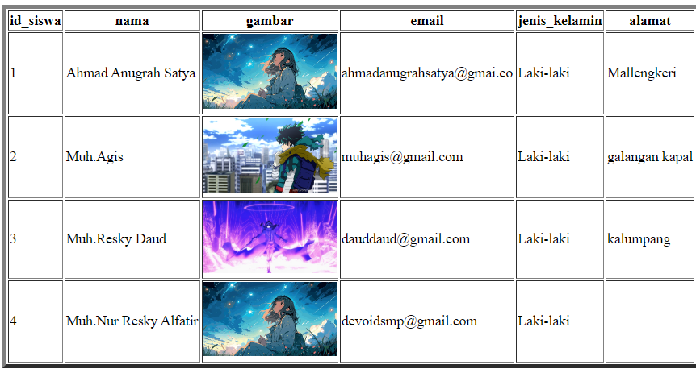

#### Analisis

- 1. `<?php`
    - Membuka blok kode PHP.
2. `// Key dari array-nya, sesuai dengan nama dari atribut name di setiap input-nya`
    - Komentar yang menjelaskan bahwa kunci array sesuai dengan atribut name dari input form.
3. `//$nama = $_POST["nama"];`
    - Baris ini dikomentari dan tidak akan dieksekusi.
4. `$umur = $_POST["umur"];`
    - Mengambil nilai dari parameter POST "umur" dan menyimpannya dalam variabel `$umur`.
5. `var_dump($_POST);`
    - Menampilkan semua data yang dikirimkan melalui metode POST untuk debugging.
6. `?>`
    - Menutup blok kode PHP.
7. `<!DOCTYPE html>`
    - Deklarasi tipe dokumen HTML.
8. `<html lang="en">`
    - Tag pembuka HTML dengan atribut bahasa "en" (English).
9. `<head>`
    - Tag pembuka untuk bagian kepala dokumen HTML.
10. `<title> XI RPL 1 - POST</title>`
    - Judul halaman yang akan ditampilkan pada tab browser.
11. `</head>`
    - Tag penutup untuk bagian kepala dokumen HTML.
12. `<body>`
    - Tag pembuka untuk bagian tubuh dokumen HTML.
13. `<p>Nama anda <?= $_POST["nama_lengkap"] ?></p>`
    - Menampilkan paragraf yang berisi nama lengkap yang diterima dari form POST menggunakan sintaks shorthand PHP `<?= ?>`.
14. `<p>Umur anda <?= $umur ?> tahun</p>`
    - Menampilkan paragraf yang berisi umur yang diterima dari form POST menggunakan sintaks shorthand PHP `<?= ?>`.
15. `<p>Password anda aman!</p>`
    - Menampilkan pesan statis bahwa password pengguna aman.
16. `</body>`
    - Tag penutup untuk bagian tubuh dokumen HTML.
17. `</html>`
    - Tag penutup dokumen HTML.

#### Kesimpulan Program
Kode ini menerima input dari pengguna melalui parameter POST, mengambil nilai `nama_lengkap` dan `umur`, lalu menampilkannya di halaman HTML. Selain itu, semua data POST ditampilkan menggunakan `var_dump` untuk tujuan debugging. Penggunaan PHP memungkinkan integrasi data dinamis dengan HTML, menjadikan halaman ini interaktif berdasarkan input pengguna. Struktur kodenya sederhana dan efisien, memanfaatkan sintaks shorthand PHP untuk menampilkan data yang diterima.

